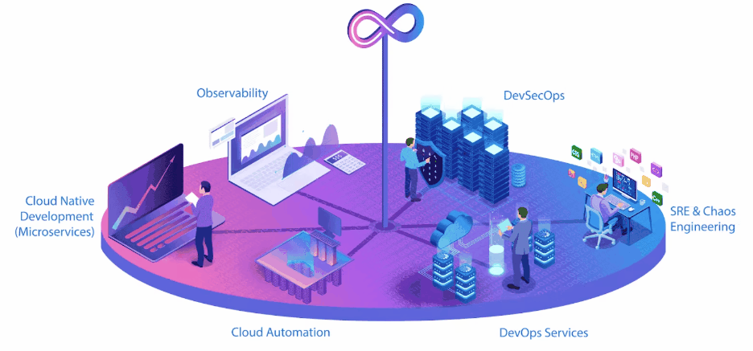

<html>

  

# 💻 DevOps | Cloud Architect | Automation 
<a
    id="cy-effective-orcid-url"
    class="underline"
     href="https://orcid.org/0009-0009-5897-7096"
     target="orcid.widget"
     rel="me noopener noreferrer"
     style="vertical-align: top">
     
      https://orcid.org/0009-0009-5897-7096
    </a>
  
<h3 align="Cente">🛠 Language and tools</h3>

  
  
  
  
  
  
  
  
  
  
  
  
  
  
  
  
  
  
  

###

**Hello!** I'm Pravin Kumar 👋, a passionate DevOps Engineer and Cloud Enthusiast, always ready to automate, optimize, and innovate! 🚀
--
### 🛠️ Technologies & Tools I Love Working With: 
- **Cloud Platforms**: AWS, Azure, GCP 🌩️
- **Infrastructure as Code**: Terraform, CloudFormation,📜
- **Configuration Management**: Ansible, Chef, Puppet 🤖
- **CI/CD**: Jenkins, GitHub Actions, 🛠️
- **Containers & Orchestration**: Docker, Kubernetes 🐳
- **Monitoring & Logging**: Prometheus, Grafana, ELK Stack 📈
- **Programming & Scripting**: Python, Bash, YAML, PowerShell 💡

---

### 🌱 Currently Learning:
- **Scaling Kubernetes Clusters** with advanced network policies and storage classes
- **Serverless Architectures** on AWS Lambda & Azure Functions
- Exploring **GitOps** with ArgoCD and FluxCD

---
### 📊 GitHub Stats:

---

### 🤝 Let's Connect:

- 🌐 [Website](https://www.aiethicallab.com
- 💼 [LinkedIn](https://linkedin.com/in/pravin-devops) 
- 📝 [Dev.to](https://dev.to/cloudpost03
- ✉️ Reach me at: [cloudpost03@gmail.com](mailto:cloudpost03@gmail.com)

---

### 🚀 DevOps Mindset:
> "Automate the boring stuff, optimize the tedious, and scale what matters." 💡

---

### 🎯 Fun Fact:
I love **problem-solving** and **system optimization**, but I’m also a big fan of coffee ☕ and cloud puns 🌥️. “Why did the DevOps engineer go broke? Because he kept pushing to the cloud!” 😄

---

**Thank you for visiting my GitHub profile!** Let's build, automate, and innovate together! 🌟

  

</html>
